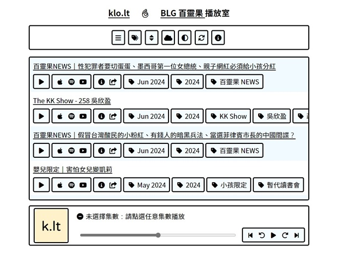

# klo.lt Podcast Player

klo.lt is a podcast player I created to organize my favorite podcasts and streamline my listening experience.

## Source code

This project is integrated from the following projects:

- [redirect](https://github.com/SotongDJ/redirect)
- [CFP2](https://github.com/SotongDJ/CFP2) (backend)
- [CFP2-BLG](https://github.com/SotongDJ/CFP2-blg)
- [CFP2-EXR](https://github.com/SotongDJ/CFP2-EXR)
- [CFP2-JST](https://github.com/SotongDJ/CFP2-JST)
- [CFP2-ASC](https://github.com/SotongDJ/CFP2-ASC)

## Included podcasts

- Bailingguo 👌
  - <https://www.bailingguonews.com/>
- 《唐陽雞酒屋》🪐
  - <https://jessetang11.firstory.io/>
- 《神仙補習班》🚀
  - <https://instagram.com/ascended_928/>
- 眼球地下電台 👁
  - <https://instagram.com/eyexradio/>

## Planning

- Podcast to include
  - [ ] 台灣通勤第一品牌
  - [ ] 瘋女人聊天室
  - [ ] 潤男的Room
  - [ ] 嗚喵備忘錄
  - [ ] 斐姨所思
  - [ ] 三尼巴掌
  - [ ] 法客電台
  - [ ] 博音
  - [ ] 呱吉
- Functions
  - [ ] Able to customize playback queue
  - [ ] offline playback
    - use browser to cache podcast and manage downloaded content are too complicated

# LICENSE

- The fonts (Noto Sans Mono, Noto Sans TC, Noto Emoji) use in this website is licensed under the SIL Open Font License 1.1.
  - See https://fonts.google.com/attribution for more detail
- The icons (Font Awesome Free) use in this website is licensed under the CC BY 4.0 License and SIL Open Font License 1.1 License
  - See https://fontawesome.com/license/free for more detail
